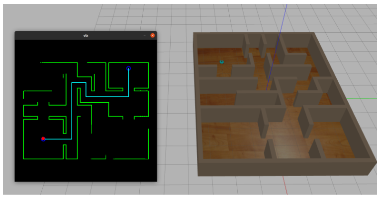

# Project-APR
This is a ROS package that was the code submission for the [show-your-skill hackathon](https://sites.google.com/view/courseraformanipal/showyourskill-2022/winners?authuser=0). It is essentially a nicer looking, simplified version of my [micromouse submission](https://github.com/arthurgomes4/micromouse/tree/main). "two birds, one stone". 

### steps for running simulation
Make sure you are using X11 as the display server and not wayland. Also disable Xserver access control with `xhost +`.
1. Start the container:  `docker compose up --build` 
2. Open a terminal in the container: `docker exec -it apr_container bash`
3. Launch the simulation in a world of your choice using `roslaunch project_apr_pkg gazebo_v2.launch`. 
4. The robot will make a searching run followed by a return run.
5. shut the container with `docker compose down`.

The detailed report is [here](./data/Project%20APR%20-%20Autonomous%20Path%20Finding%20Robot.pdf). It explains a bit about how it works. [video link](https://drive.google.com/file/d/1F4H0WTcQ1YsR3YNreIgvjz4NtmTIO3nO/view?usp=drive_link).

